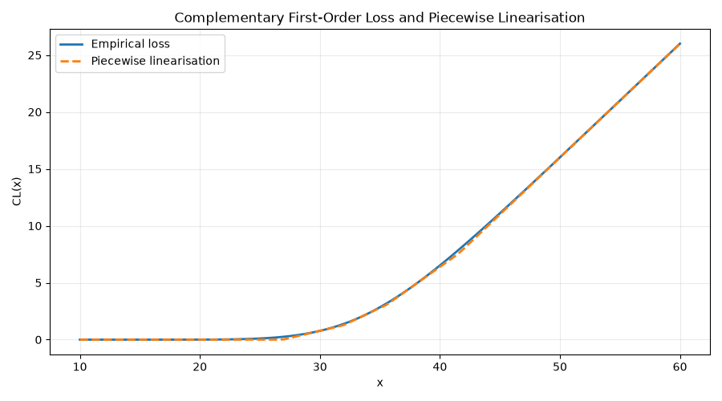

# folf

`folf` computes Edmundson-Madansky (UB) and Jensen-based (LB) piecewise linear approximations suitable for embedding the first order loss function in mixed-integer linear optimization models.

[](https://github.com/gwren/folf/actions/workflows/ci.yml)
[](https://codecov.io/gh/gwr3n/folf)
[](https://pypi.org/project/folf/)
[](https://pypi.org/project/folf/)
[](https://github.com/gwr3n/folf/commits/main)
[](https://pepy.tech/project/folf)
[](https://www.python.org/downloads/)
[](LICENSE)
[](https://github.com/psf/black)
[](https://github.com/astral-sh/ruff)
[](https://github.com/python/mypy)



## Features

- Empirical first-order and complementary first-order loss functions
- Scalar-product variants, including multivariate normal closed-form approximation
- Jensen partitioners (uniform and minimax)
- Piecewise linearization helpers and linearization-parameter chooser
- Probability sampling utilities (SRS and LHS)

## Who This Is For

This library is useful when you need approximate or empirical first-order loss
functions for inventory and stochastic optimization workflows, especially with
normal or sampled demand models.

## References

R. Rossi, S. A. Tarim, B. Hnich, and S. Prestwich,
"[Piecewise linear lower and upper bounds for the standard normal first order loss function](https://arxiv.org/abs/1307.1708),"
*[Applied Mathematics and Computation](https://dx.doi.org/10.1016/j.amc.2014.01.019)*,
Elsevier, vol. 231, pp. 489-502, 2014.

R. Rossi, E.M.T. Hendrix,
"[Computing linearisation parameters of arbitrarily distributed first order loss functions](https://gwr3n.github.io/chapters/Rossi_et_al_MAGO_2014_2.pdf),"
in *Proceedings of MAGO'14, XII Global Optimization Workshop (GOW)*.

R. Rossi, S. Prestwich, and S. A. Tarim,
"[Mixed-Integer Linear Programming Approximations for the Stochastic Knapsack](https://arxiv.org/abs/2512.14912),"
*[Computers & Operations Research](https://doi.org/10.1016/j.cor.2026.107571)*,
Elsevier, Vol. 194: 107571, 2026.

## Installation

```bash
pip install -e .
```

Command-line usage:

```bash
folf-cli --help
```

For development:

```bash
pip install -e .[dev]
```

## Quick Start

### CLI: Plot a loss function and its piecewise linearisation

```bash
folf-cli plot-loss \
	--distribution poisson:20 \
	--distribution norm:8:2 \
	--distribution gamma:4:1.5 \
	--sampling LHS \
	--samples 5000 \
	--x-min 10 \
	--x-max 60 \
	--precision 0.5 \
	--piecewise-masses 0.25,0.25,0.25,0.25 \
	--loss-type complementary \
	--output artifacts/loss_piecewise.png
```

Supported distributions in CLI:

- `poisson:<lambda>`
- `norm:<mu>:<sigma>`
- `gamma:<shape>:<scale>`

The command produces a plot with:

- Empirical loss function curve
- Piecewise linearisation curve

### 1. Empirical first-order loss from sampled distributions

```python
from scipy.stats import gamma, norm, poisson

from folf import FirstOrderLossFunction
from folf.utilities.probability.sampling import SAMPLING

folf = FirstOrderLossFunction(
	distributions=[
		poisson(20),      # discrete demand component
		norm(8, 2),       # approximately normal component
		gamma(a=4, scale=1.5),  # right-skewed positive component
	],
	sampling_strategy=SAMPLING.SRS,
)

x = 70.0
nb_samples = 5_000

complementary = folf.get_complementary_first_order_loss_function_value(x, nb_samples)
regular = folf.get_first_order_loss_function_value(x, nb_samples)

print("CL(x):", complementary)
print("L(x):", regular)
```

### 1b. Compare SRS vs LHS sampling strategies

```python
from scipy.stats import gamma, norm, poisson

from folf import FirstOrderLossFunction
from folf.utilities.probability.sampling import SAMPLING

distributions = [
	poisson(20),
	norm(8, 2),
	gamma(a=4, scale=1.5),
]

srs_model = FirstOrderLossFunction(distributions, sampling_strategy=SAMPLING.SRS)
lhs_model = FirstOrderLossFunction(distributions, sampling_strategy=SAMPLING.LHS)

x = 70.0
nb_samples = 2_000

cl_srs = srs_model.get_complementary_first_order_loss_function_value(x, nb_samples)
cl_lhs = lhs_model.get_complementary_first_order_loss_function_value(x, nb_samples)

print("CL(x) using SRS:", cl_srs)
print("CL(x) using LHS:", cl_lhs)
```

Use `SRS` for a straightforward baseline and `LHS` when you want lower Monte Carlo
variance for the same sample count.

### 2. Scalar-product first-order loss with multivariate normal demand

```python
import numpy as np

from folf import FirstOrderLossFunctionScalarProductMVN

model = FirstOrderLossFunctionScalarProductMVN(
	mean=np.array([10.0, 15.0, 20.0]),
	covariance=np.array(
		[
			[4.0, 1.2, 0.8],
			[1.2, 9.0, 2.0],
			[0.8, 2.0, 16.0],
		]
	),
	independent_demand=False,
)

weights = np.array([0.5, 0.3, 0.2])
y = 14.0

cl = model.get_complementary_first_order_loss_function_value(y, weights)
l = model.get_first_order_loss_function_value(y, weights)

print("CL(y):", cl)
print("L(y):", l)
```

### 3. Choose piecewise linearization parameters

If you are embedding first-order loss terms in an optimization model (for
example MILP or MIP), you typically replace nonlinear loss expressions with a
piecewise linear approximation. `LinearisationFactory.choose_linearisation_parameters`
helps pick:

- `w_segments`: how many loss-function segments to use
- `q`: how many variance/sqrt partitions to use

for a requested approximation tolerance `epsilon`, variance bound `vmax`, and
cost coefficient `c`.

```python
from folf import LinearisationFactory

epsilon = 0.5
vmax = 4.0
c = 10.0

w_segments, q = LinearisationFactory.choose_linearisation_parameters(epsilon, vmax, c)
print("segments:", w_segments)
print("q:", q)
```

## Typical Workflow

1. Model your demand distribution(s) with SciPy distributions or a normal
   mean/covariance pair.
2. Compute CL(x) or L(x) either empirically (sampling) or from the MVN
   closed-form helper.
3. If building optimization models, use the Jensen partitioners or
   linearization factory to derive approximation parameters.

## Public API At A Glance

- FirstOrderLossFunction
- FirstOrderLossFunctionScalarProduct
- FirstOrderLossFunctionScalarProductMVN
- JensenUniformPartitioner
- JensenMinimaxPartitioner
- PiecewiseStandardNormalFirstOrderLossFunction
- LinearisationFactory

## Quality Checks

```bash
./venv/bin/python -m pytest -q
./venv/bin/python -m ruff check .
./venv/bin/python -m mypy src/folf
```

## Release Metadata

- Homepage: https://github.com/gwren/folf
- Repository: https://github.com/gwren/folf
- Issue Tracker: https://github.com/gwren/folf/issues
- Changelog: [CHANGELOG.md](CHANGELOG.md)

## Package Layout

- `src/folf`: Main library package
- `src/folf/utilities`: Utility modules analogous to Java utilities
- `tests`: Basic smoke and behavior tests

## Changelog

Release notes follow [Keep a Changelog](https://keepachangelog.com/en/1.1.0/). See [CHANGELOG.md](CHANGELOG.md).
